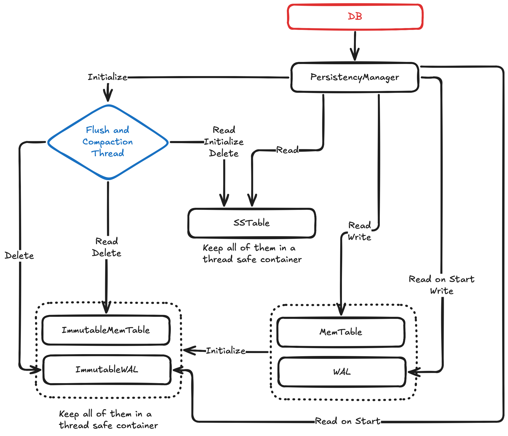
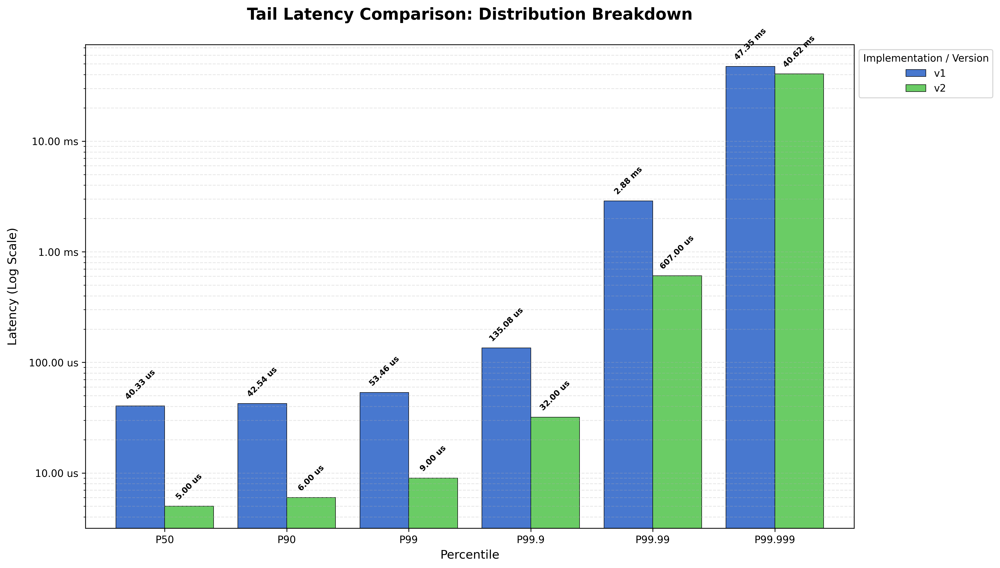

# HashMapDB

**HashMapDB** is a lightweight **embedded key-value storage library** written in C++.  
It implements persistence using a **Log-Structured Merge Tree (LSM-tree)** architecture.

The project is designed as a **modular storage engine**, allowing experimentation with different in-memory data structures and persistence strategies.

---

# Features

- Embedded **C++ key-value storage library**
- **Pluggable MemTable implementations**
- **Write-Ahead Logging (WAL)** for crash recovery
- **Immutable MemTables with asynchronous flushing**
- **SSTable-based persistent storage**
- **Memory-mapped file IO (mmap)**
- Benchmarking and latency percentile analysis

### Planned features

- SSTable **compaction**
- **Bloom filters**
- **Concurrent write pipeline**

---

# Architecture

The following diagram shows how the components interact.



The system follows a classic **LSM-tree pipeline**:

```
Writes → MemTable → Immutable MemTable → SSTable
           │              │
           └── WAL        └── Immutable WAL
```
---

# Core Components

## MemTable

The **MemTable** is the in-memory structure that temporarily stores key-value pairs before they are flushed to disk.

This project allows **any data structure** to be used as a MemTable, as long as it implements the following interface:

```
insert(std::string key, std::string value)
update(std::string key, std::string value)
remove(std::string key)
count(std::string key) -> bool
get(std::string key) -> std::string
flush() -> std::map<std::string, std::string>
reset()
size() -> uint64_t
```

Two types of MemTables exist:

### Live MemTable

The active in-memory structure receiving all writes.

### Immutable MemTable

Once the MemTable reaches a size threshold, it becomes **immutable** and is scheduled for flushing to disk as an **SSTable**.

A new **Live MemTable** is then created to continue accepting writes.

---

## Write-Ahead Log (WAL)

The **Write-Ahead Log** ensures durability by recording all updates before they are applied to the MemTable.

Two WAL types exist:

### Mutable WAL

Tracks updates applied to the **Live MemTable**.  
If the system crashes, this log is replayed to reconstruct the MemTable.

### Immutable WAL

Each **Immutable MemTable** has a corresponding WAL.

This enables **asynchronous flushing**: if the system crashes before the MemTable is persisted, the Immutable WAL can be used to reconstruct it and retry the flush.

---

## Flushing MemTables

MemTables are flushed to disk by a **dedicated background thread**.

Whenever an **Immutable MemTable** exists, the flushing thread converts it into an **SSTable**.

Flushing uses **memory-mapped IO (`mmap`)** to efficiently write the data to disk.

---

## SSTable File Format

SSTables are immutable binary files with the following structure:

```
[Entries]
key_size | key | value_size | value
key_size | key | value_size | value
...
[Footer]
number_of_entries
bloom_filter
```
SSTables are read during lookups after checking the MemTables.

---

## Crash Recovery

When the system restarts, recovery proceeds as follows:

1. Replay the **Mutable WAL** to reconstruct the Live MemTable
2. Replay all **Immutable WALs** and flush them to SSTables
3. Load all existing **SSTable files**

This guarantees that no acknowledged writes are lost.

---

# Planned Features

## Compaction

To prevent the number of SSTables from growing indefinitely, a **compaction process** will periodically merge multiple SSTables into a new one.

This reduces read amplification and improves lookup performance.

---

## Bloom Filters

Each SSTable will include a **Bloom filter** to quickly determine whether a key *might* exist in the file.

Properties:

- No false negatives
- Small probability of false positives

Planned configuration:

- `2^15` bitset
- `3` independent hash functions

If all bits corresponding to the hashes are set, the key **may exist** in the SSTable.

---

## Concurrency

The current design will be extended with a **Multi-Producer Single-Consumer (MPSC)** queue at the database entry point.

### Advantages

- Simplifies thread safety
- Ensures causal ordering of operations

### Trade-offs

- Increased implementation complexity
- The caller lost track of fails during persistency.

---

# Usage

## Requirements

- **C++23**
- **g++ 14+**

---

## Build

```bash
make
```

---

# Benchmarking:

## Running Benchmarks:
First build the project:
```bash
$ make
```

Then run one of the benchmark configurations:
```bash
./build/benchmark bench/configs/200K_rand_fill.config
```

---

## Latency Analysis:
To visualize latency percentiles across versions:
```bash
python bench/plot/version_percentiles.py 
```

---


## Example Result:
The following example compares write latency percentiles between two versions:
- **v1**: synchronous MemTable flush
- **v2**: background flushing thread




---

# Project Goals
HashMapDB is intended as a **learning-oriented storage engine**, exploring the internal design of modern LSM-based databases such as:
- LevelDB
- RocksDB
- Pebble
The project focuses on **simplicity, modularity, and performance experimentation**.